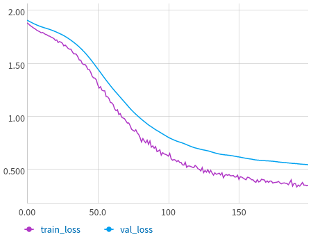
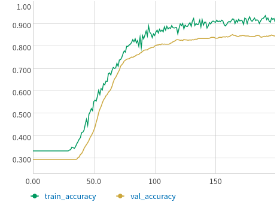

# Graph Convolution Network

PyTorch implementation of ["Semi-Supervised Classification with Graph Convolutional Networks"](https://arxiv.org/abs/1609.02907)


### References
* https://github.com/tkipf/pygcn
* https://github.com/hazdzz/GCN


### To run the node classification in CORA dataset
```
python main.py cora-node-classification
```
### Results
Train-Val Loss Comparison<br/>




Train-Val Accuracy Comparison<br/>



#### Test Accuracy: 82.4 %

### Setup
* Setup env using [poetry](https://python-poetry.org/docs/)
* Update *neptune_project_name* and *neptune_api_token* values in **config/settings.yaml** file